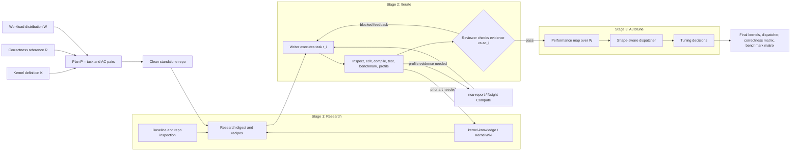
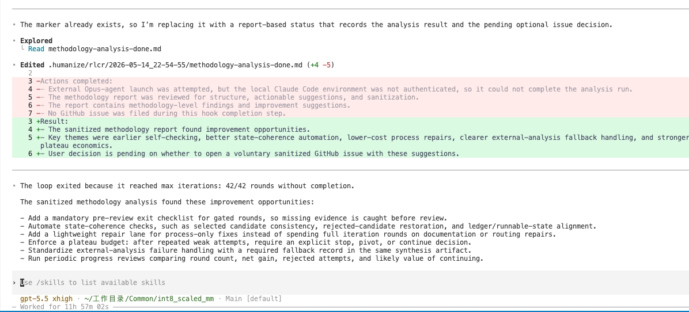
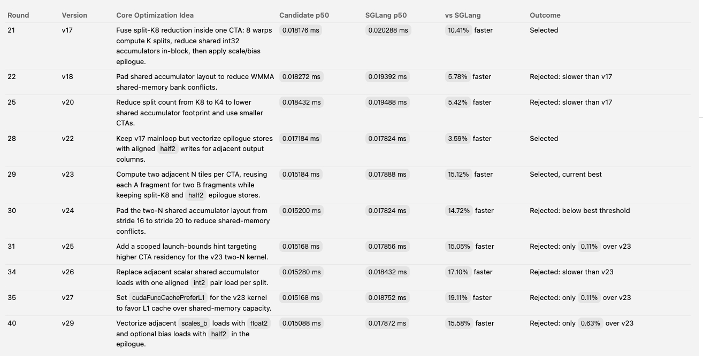

<div align="center">

# KernelPilot

**An autonomous Humanize-powered GPU kernel optimization loop with a local
PR-driven CUDA knowledge base, Nsight Compute report skills, and clean
standalone benchmark repos.**

[](https://github.com/BBuf/kernel-pilot/stargazers)
[](https://github.com/BBuf/kernel-pilot/forks)
[](https://github.com/BBuf/kernel-pilot/commits/main)
[](knowledge/evidence/pull-bundles/)
[](knowledge/wiki/)
[](knowledge/data/refresh-cutoff.yaml)

</div>

KernelPilot is for serious CUDA kernel tuning runs where the important facts
are easy to lose: which upstream PR inspired a candidate, which shape regressed,
what Nsight Compute actually said, which evidence changed the next edit, and
whether the candidate belongs in a framework repo or a clean experiment.

The project packages three cooperating skills:

| Skill | Role |
| --- | --- |
| [`humanize-kernel-agent-loop`](humanize/skills/humanize-kernel-agent-loop/) | Turns kernel definition `K`, reference `R`, and workload distribution `W` into task-acceptance pairs, a standalone optimization repo, autonomous research/iteration/autotuning, correctness tests, benchmarks, ledgers, dispatcher, tuning decisions, and review-gated iteration. |
| [`kernel-knowledge`](knowledge/SKILL.md) | A local PR-diff-first CUDA kernel evidence corpus. It routes by architecture, repo, topic, technique, profile symptom, operator, and DSL, then opens PR diffs, source snapshots, wiki pages, docs, and blogs as needed. |
| [`ncu-report`](humanize/skills/ncu-report/) | Converts Nsight Compute reports into a reproducible profile digest: metrics, source counters, PM sampling, PTX/SASS hotspots, bottleneck diagnosis, and exactly one next kernel edit. |

Together they make an optimization loop that can work from a simple request:

```text
[$humanize-kernel-agent-loop] Optimize SGLang's GEMM path for M=64, N=2048, K=2048, fp16, bias=true, and beat the current SGLang baseline by at least 10%.
```

The loop decides how to plan, when to query knowledge, what to profile, how to
record lineage, how to scan the workload distribution, and when to ask the
Humanize review gate whether another round is needed. The human should specify
the target when it is ambiguous; the loop owns the rest.

## Why Use It

- **PR-diff-grounded prior art.** The knowledge base is organized around real
  merged kernel PRs, with review diffs and source snapshots materialized under
  `knowledge/evidence/pull-bundles/`.
- **Standalone by default.** Candidate kernels do not pollute SGLang, vLLM,
  PyTorch, or other large framework repos. The loop creates an isolated repo
  with bindings, tests, benchmarks, ledgers, lineage, and profile artifacts.
  The standalone repo is where implementation artifacts, provenance, and
  measurements live.
- **Evidence-driven profiling.** The loop decides when `ncu-report` is worth
  running, then uses it to move from vague labels like "memory-bound" toward
  measured bottlenecks and one concrete next edit.
- **Knowledge-backed edits.** The agent can read PRs, wiki pages, official
  docs, blog/code notes, and profiler examples when they help explain a
  benchmark result, profile symptom, regression, plateau, or next edit.
- **Review-gated iteration.** Humanize RLCR keeps the loop from declaring
  victory too early; default loop budget is 84 iterations unless configured
  otherwise.
- **Shape-aware tuning.** The loop treats benchmark cases as a workload
  distribution, builds a performance map, and emits dispatcher/tuning decisions
  when different regimes need different kernels or configurations.

## Kernel Agent Loop



The writer agent is not hardcoded. In Codex it can be Codex; in Claude Code it
can be Claude. The review backend and model come from Humanize configuration.
Unlike the paper's in-repository version, KernelPilot keeps implementation
artifacts in a clean standalone repo unless the user explicitly asks for an
in-place framework patch.

## Kernel Requests

A useful request names the kernel definition, correctness reference, workload
distribution, target hardware, scope, benchmark method, and performance target.
KernelPilot turns that into a task-acceptance plan, an isolated implementation
workspace, repeatable measurements, profiler evidence, lineage, performance
map, dispatcher/tuning decisions, and Humanize review rounds.

Existing implementations, PR diffs, docs, blogs, and profile reports are working
materials for the loop. When external source or design evidence materially
influences a candidate, the standalone repo records the provenance, license or
notice requirements, and the optimization delta.

## Knowledge Base

The knowledge base lives in [`knowledge/`](knowledge/). It is a local skill root
and does not need a global environment variable for normal query use.

Current snapshot:

| Corpus layer | Contents |
| --- | --- |
| PR evidence | 3,660 merged CUDA/Triton/CuTe/CUTLASS-related PR bundles from 14 upstream repos, Jan 2024 through May 16 2026. |
| Synthesized wiki | 52 pages across hardware features, techniques, kernels, problem patterns, DSL guides, and migration notes. |
| Source notes | 26 blog/community summaries, 17 doc/reference summaries, and 7 competition pages. |
| Query indices | Auto-generated views by problem, technique, hardware feature, repo, kernel type, and language. |
| Candidate ledgers | 14 include/defer ledgers for PR ingestion. Dropped PRs are not kept as per-PR rows. |

Primary organization:

```text
knowledge/
|-- SKILL.md
|-- README.md
|-- index.md
|-- scripts/
|   |-- query.py
|   |-- get_page.py
|   |-- grep_wiki.py
|   |-- fetch-pr-evidence.py
|   `-- validate.py
|-- sources/
|   |-- prs/
|   |-- docs/
|   |-- blogs/
|   `-- contests/
|-- evidence/
|   |-- pull-bundles/
|   |-- blog-capsules/
|   |-- challenge-capsules/
|   `-- kernel-cases/
|-- wiki/
|   |-- hardware/
|   |-- techniques/
|   |-- kernels/
|   |-- patterns/
|   |-- languages/
|   `-- migration/
|-- queries/
|-- candidates/
`-- data/
```

The important rule is **PR-diff first, not PR-only**. PR diffs and materialized
source snapshots are the strongest implementation evidence. Wiki pages, docs,
blogs, contests, and query indices are still first-class support material for
hardware contracts, DSL semantics, profile interpretation, and technique
selection.

Knowledge artifacts are available throughout the loop. Record the material
source or profile evidence in lineage, ledgers, or profile digests when it
changes the candidate or the next edit.

## Query Examples

Run knowledge tools from the knowledge root:

```bash
cd knowledge
python3 scripts/query.py "tcgen05" --architecture B200 --limit 10
python3 scripts/query.py --repo pytorch/pytorch --compact
python3 scripts/get_page.py pr-pytorch-157241 --follow-sources
python3 scripts/grep_wiki.py "warp_issue_stalled" --only sources --any
python3 scripts/validate.py
```

Wiki, doc, and blog support queries:

```bash
cd knowledge
python3 scripts/query.py "Blackwell memory hierarchy" --type hardware --limit 10
python3 scripts/query.py --type technique --tag pipeline-stages --compact
python3 scripts/query.py "PTX cache policy" --type language --compact
python3 scripts/query.py "tcgen05 tmem tuning guide" --type official-doc --limit 10
python3 scripts/query.py "Blackwell microbenchmark tensor memory" --type benchmark-blog --limit 10
```

## ncu-report

`ncu-report` standardizes the profiling part of the loop. It creates a digest
that compares a candidate to a baseline or parent version and ends with one
specific edit to try next.

Typical capture:

```bash
mkdir -p profile-artifacts/v000_baseline
ncu --target-processes all \
    --kernel-name regex:"<kernel-name-pattern>" \
    --launch-skip 5 --launch-count 1 \
    --set full --import-source on \
    --section SpeedOfLight \
    --section SchedulerStats \
    --section WarpStateStats \
    --section Occupancy \
    --section LaunchStats \
    --section MemoryWorkloadAnalysis \
    --section SourceCounters \
    -o profile-artifacts/v000_baseline/report \
    python benchmarks/<bench>.py --shape <shape> --dtype <dtype>

ncu --import profile-artifacts/v000_baseline/report.ncu-rep \
    --page raw --csv > profile-artifacts/v000_baseline/raw.csv
ncu --import profile-artifacts/v000_baseline/report.ncu-rep \
    --page details > profile-artifacts/v000_baseline/details.txt
```

The skill inspects SpeedOfLight, scheduler stats, warp state stalls, occupancy,
launch stats, memory workload, source counters, PM sampling when the installed
NCU exposes it, and when relevant PTX/SASS dumps from `cuobjdump` or
`nvdisasm`.

## Install

Fresh install for Codex:

```bash
git clone https://github.com/BBuf/kernel-pilot.git
cd kernel-pilot
humanize/scripts/install-skills-codex.sh
```

Generic installer:

```bash
cd kernel-pilot
humanize/scripts/install-skill.sh --target codex
```

The installer hydrates `{{KERNELPILOT_ROOT}}` into installed skills and
validates that the root contains `knowledge/SKILL.md` and
`knowledge/evidence/pull-bundles/`. If the knowledge base is missing, install
fails instead of producing a broken skill.

For Kimi-oriented setups, use:

```bash
cd kernel-pilot
humanize/scripts/install-skills-kimi.sh
```

After installation, restart the agent session and check that these skills are
available:

```text
humanize-kernel-agent-loop
kernel-knowledge
ncu-report
```

If Humanize reports that hooks need review, approve the Stop hook in the client
UI before relying on review-gated loop exits.

## Prompt Card

Kernel optimization:

```text
[$humanize-kernel-agent-loop] Optimize SGLang's int8_scaled_mm kernel on H100 for M=64, N=2048, K=2048, out_dtype=fp16, bias=true. Keep the work in a clean standalone repo, compare correctness and latency against the current SGLang baseline, and beat that baseline by at least 10% p50 latency on this focused case.
```

Keep the prompt focused on the target kernel, environment, correctness checks,
benchmark, and performance target.

Example result from this shape:

| Shape | Candidate | SGLang baseline | Result |
| --- | ---: | ---: | ---: |
| `M=64, N=2048, K=2048, fp16+bias` | `0.015184 ms` p50 | `0.017888 ms` p50 | `15.12%` faster |

The stop hook summary should make the round outcome and review decision easy to
inspect:



The optimization ledger should make selected versions and rejected follow-ups
easy to scan:



## Maintenance

Validate the knowledge base:

```bash
cd knowledge
pip install -r requirements.txt
python3 scripts/validate.py
```

Regenerate query indices after editing wiki/source frontmatter:

```bash
cd knowledge
python3 scripts/generate-indices.py
python3 scripts/validate.py
```

Materialize missing PR evidence bundles during corpus maintenance:

```bash
cd knowledge
python3 scripts/fetch-pr-evidence.py --repo pytorch/pytorch --max-files 16
python3 scripts/validate.py
```

Run Humanize tests after changing skills:

```bash
cd humanize
tests/run-all-tests.sh
```

## Star History

[](https://www.star-history.com/#BBuf/kernel-pilot&Date)

## Related

- [Humanize](https://github.com/PolyArch/humanize): the RLCR runtime that
  KernelPilot specializes for GPU kernel optimization.
- [AI-Infra-Auto-Driven-SKILLS](https://github.com/BBuf/AI-Infra-Auto-Driven-SKILLS):
  broader serving, profiling, SGLang, incident, and model optimization skills.
